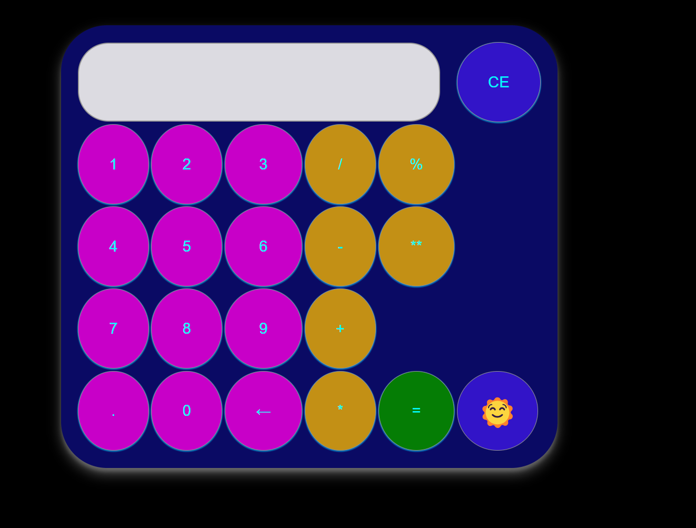

# Calculator App

## About

### Research

#### General Start
The project started as an attempt to create a functional calculator that encorporated different features that I had seen other programmers do on GitHub and the web as general practice. As I started to research, I realized there are many more ways to skin the calculator cat than I had previously understood. I liked many common features I found during my research: using a table format, with input button elements for the keys, using keymapping (though mine was pretty simple), regular expression usage (opted this out), inline vs. straight-JS functions to call features, and even found some pretty intresting wrapper functions for the event listeners, rather than just basic DOM event handling. 

#### Use Of AI - Good and Bad
I also jumped on to Open AI Chat GPT 3.5 to ask some general questions about modularity and listener cleanup. This was an interesting experience, as I have used Open AI a few times to answer difficult questions while in school, but didn't realize that some of its answers were actually pretty unusable, and often didn't work at all. I learned that you have to be a fairly adept developer to work using AI, as you will have to restructure, refactor, and seriously mod any code that you give it, or ask it about, to actually use within most project workflows. While I thought this was a valuable experience, I would caution young, or language inexperienced devs, in putting too much weight on artificial intelligence while coding -- AI is great to ask a syntax question: "given the following constructor approach, how might you implement this feature...", but realize that the answer it gives will likely require some very heavy modification to be usable.

#### Finally...
I did create some private versions of multiple approaches, using other devs design models, but in the end, I wanted to build one of these fairly well from scratch, so I adopted some of the features I found, using my own coding approaches -- often simplifying some of the more difficult ideas I found, as JavaScript calculators can range from very simple, to extremely capable; creating my own fairly reproducable design! I may include a few other GitHubbers, YouTubers and web calculators I find over time at the bottom of the MD! But at the time of writing this, not planning on updating this approach heavily, just realize that there is a lot f ground to cover regarding DOM interaction for calculators. So the links will cover a few of the good, and the bad, designs I researched when starting; and some potential future approaches that people might be interested in.

## My Design

#### Calculator Functions/Functionality:
- ADD
- SUBTRACT
- MULTIPLY
- DIVIDE
- EXPONENTIATION
- MODULUS (division remainder)
- Backspace
- Clear Screen
- Auto-clear after Calculation (when a new button is pushed)

### Coding Design
#### HTML
- Basic HTML Table design for the calculator
- Buttons were inputs inside of the table rows

#### CSS
- Simple light/dark toggle
    - CSS mod for :root custom property declaration
    - Corresponding button -- HTML-- for toggle
- :root CSS var declartions for custom properties (used rgba color schema on this one, kind of getting used to hsl on most of mine lately -- especially for blends)

#### JavaScript
- Vanilla JS script addressed using all functionality as callbacks inside of general DOM ContentLoaded event listener
- Hash array used for calculator function lookup
- modular approach to add event listeners, calling the button mapper inside of the listener
    - Button map filter calls functions for specific key functionality
    - flag for basic workflow, to add auto cleanup of results window after calculation is performed, and new calculation is attempted
- wrapped cleanup inside of window call at the end

I appreciated using a key mapping approach, passing the general DOM get as a class driven input filter for button content, rather than individual id's relating to each button. I think that the CSS was pretty useful in making the calculator itself, more readable and useable; the shadowing was great to give some depth to the calculator body and the buttons. 
Finally, and esthetically speaking, I used a light/dark toggle to play about some small amount with the CSS appearance and shadowing; a small nod to my appreciation of the CSS lessons I keep pursuing. My light/dark icons were thanks to a fellow JS dev [vydroz](https://codepen.io/vydroz/pen/jOGywpO), and while his approach was much more involved for the JS calculator itself, containing history and outside links and a bunch of fun regex approaches,there were some sweet icons, and a good idea for some of the basics on light/dark to use...lol 
    

### Hours Worked:
Since most of these types of projects are undertaken by JR developers looking for some quick resume fill, I figured I would give an understanding of what time it took me to write this; for a senior, probably about half of this (and twice as good), for a junior that struggles with beginner JS maybe double? Notice the write-up and research is a lot of the game.
- #### Initial Research
    - 2-4 hours
- #### Code Primary
    - 2 hours
- #### BugFix
    - 6-8 hours
- #### Writeup
    - 2 hours
- #### Upgrades (all coding done after intial project finished)
    - Calc bug (eval() removal):
        - 10 min
    - Function event clean:
        - 20 min
    

## ToDo:
- I had a little fun with the CSS, but haven't fully scaled it properly yet for tablet and mobile.
- Jest add coming in future version
- Probably could update the hash array, into a full hash Map, or hash object approach -- I purely wanted the functionality of a fast reference point, but didn't want the complexity of a true Hashable feature, though maybe will do this on a future calculator project.
- React version would be a good idea; or maybe a React/Vanilla JS wrapper on a Python shell (vastly prefer OOP script, and C-based, languages for doing basic math...lol)
- Using eval() is also a scripting issue for security -- you really want to use it indirectly (a problem with early versions of this project); using the current version of my evaluate function is still a string-based approach that is slower than parsing numbers, as it uses an invocation of the JavaScript interpreter...just a PSA 

# Pictures
### Dark Mode

### Light Mode

## References and Links:
- #### [This project](https://github.com/PGA-dev/Calculator)
- #### YouTuber WebDev Simplified Kyle's approach (I like the simplicity, but elegant functional approach): [Vanilla-JavaScript-Calculator](https://github.com/WebDevSimplified/Vanilla-JavaScript-Calculator)
- #### My Icon guy (light/dark): [CalculatorJS](https://codepen.io/vydroz/pen/jOGywpO)
- #### Really simple approach to basics to start: [JavaScript Calculator](https://www.javatpoint.com/javascript-calculator)
- #### Some more modular approaches, food for thought (really like the ternary usage and cleanliness of the code), there is a Free Code Camp version of Zell's down below as well: [How to build a calculator—part 3](https://zellwk.com/blog/calculator-part-3/)
- #### Here are a couple of coding challenge versions that I have seen recently: 
    - #### [Calculator app](https://www.frontendmentor.io/challenges/calculator-app-9lteq5N29)
    - #### [Calculator-JavaScript](https://github.com/CodeExplainedRepo/Calculator-JavaScript/tree/master)
- #### A couple of fairly simple versions, they have bugs, but is a good start to understand some basics when I first started looking for design: 
    - #### [How to Build a Simple Calculator Using HTML, CSS, and JavaScript](https://www.makeuseof.com/build-a-simple-calculator-using-html-css-javascript/)
    - #### [JavaScript Calculator](https://www.geeksforgeeks.org/javascript-calculator/)
- #### This Free code Camp approach, by Zell Liew, is a more elaborate state driven mapping, but kind of crap for the CSS and aethetic content (may try something a bit more like this in the future): [How to build an HTML caculator app from scratch using JavaScript](https://www.freecodecamp.org/news/how-to-build-an-html-calculator-app-from-scratch-using-javascript-4454b8714b98/)
